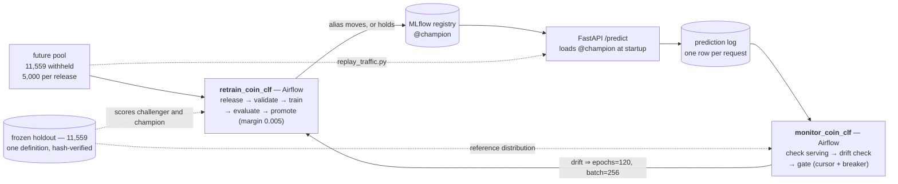
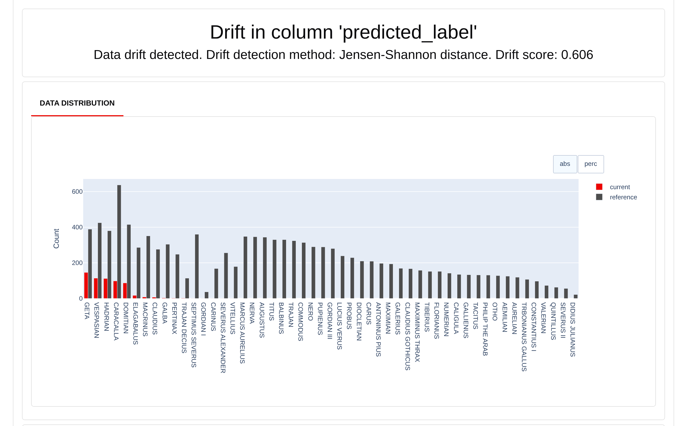
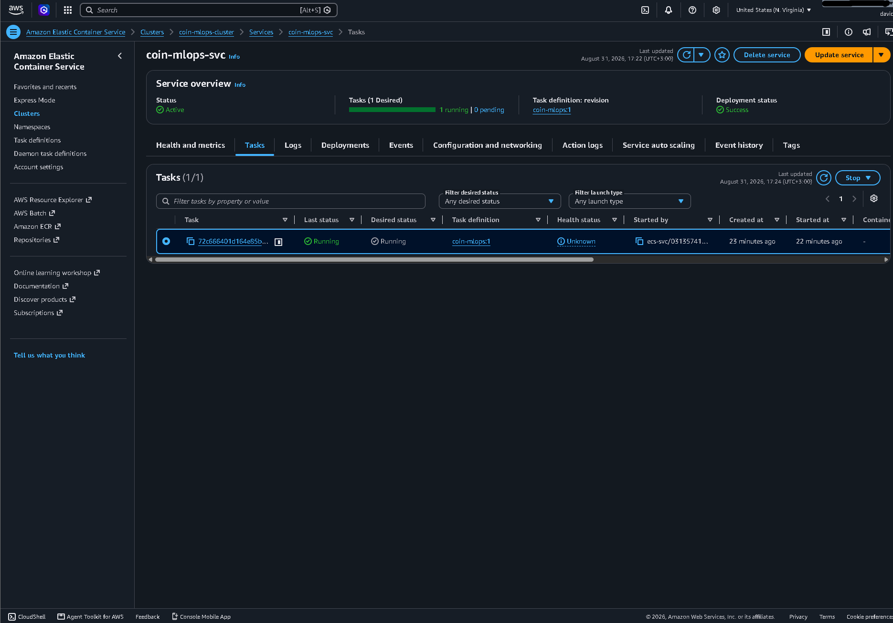

# MLOps platform for an image classifier — retraining, promotion gating, and drift monitoring

[](https://github.com/Davids3498/Coins/actions/workflows/ci.yml)

The workload is a Roman-coin classifier: photos of Roman Imperial coins sorted by
emperor, 51 classes, 57,792 images, a MobileNetV3-Large at **0.9201** holdout
accuracy. The deliverable is everything around it — a dataset carved once into
partitions that are *provably* disjoint by content hash, an MLflow registry whose
`@champion` alias only moves through a gate that re-scores both models, a FastAPI
server that logs every prediction, an Evidently drift check over that log, and two
Airflow DAGs that close the loop from "traffic looks wrong" back to "a new
challenger was trained, scored, and accepted or refused."

The coins are interchangeable. The pipeline is the point.

## Architecture



## What this demonstrates

* **A dataset carved once, disjoint by content hash** — not filename, so a re-uploaded coin is caught. [→](docs/dataset.md)
* **A promotion gate that has actually refused** — v11 (0.9150) lost to champion v10 (0.9201); both re-scored fresh. [→](docs/pipeline.md)
* **Drift detection with measured thresholds** — reference is the champion's own holdout predictions, thresholds calibrated against a simulated null. [→](#drift-detection-demonstrated)
* **A closed loop with runaway protection** — a consuming cursor and a circuit breaker, covering different failures. [→](docs/pipeline.md)
* **Serving that stays testable without infrastructure** — the model loads in a lifespan; CI proves it imports under `--network none`. [→](docs/serving.md)
* **Infrastructure that was actually run** — Terraform to Fargate, parity-checked, destroyed, verified empty. [→](docs/cloud-deploy.md)
* **CI as a real merge gate** — 159 tests, ruff, mypy, image smoke test, and a deploy job no merge can reach. [→](docs/development.md)
* **Three bugs worth reading about** — a guard that passed the case it existed to catch, a checker that measured itself, an ignore file that was a standing bug. [→](docs/engineering-notes.md)

## Drift detection, demonstrated

Two replay runs against champion v10 — 600 and 601 requests — scored against the
champion's own predictions on the 11,559-image holdout. `normal` sends untouched
file bytes from the unreleased future pool; `skewed` restricts to 5 classes,
downsizes to 96px and converts to grayscale.

| Signal | Normal | Skewed | Threshold | Method |
|---|---|---|---|---|
| `predicted_label` | 0.114 | **0.606** | 0.35 | Jensen-Shannon |
| `confidence` | 0.053 | **0.812** | 0.25 | Wasserstein (normed) |
| `width` | 0.058 | **0.870** | 0.25 | Wasserstein (normed) |
| `height` | 0.059 | **0.876** | 0.25 | Wasserstein (normed) |
| `mode` | 0.000 | **0.833** | 0.35 | Jensen-Shannon |

`status=ok, drift_detected=false` for the normal run; `status=ok,
drift_detected=true` on all three signals for the skewed one. Both runs saw only
v10 rows — 0 excluded for a version mismatch. The machine-readable verdicts the
DAG branches on are tracked: [normal](docs/drift_verdict_normal.json),
[skewed](docs/drift_verdict_skewed.json).

Two results worth more than the pass/fail:

* **Normal traffic's mean confidence was 0.786; the reference's was 0.780.** That
  is the holdout-as-reference choice validating itself empirically — unseen
  production-shaped images score where the holdout scores, which is exactly why
  the reference is not the training split (the champion trained on that for 120
  epochs, so its confidence there is memorization-inflated and day-one traffic
  would look like drift).
* **The skewed batch contained 5 true classes but drew 16 distinct predictions.**
  Degradation doesn't just shift mass onto the right 5 labels — it pushes the
  model into confusions it never makes on clean inputs. The red bars below are
  the degraded batch; the grey is the reference across all 51 classes.



## Engineering notes

Three things that were wrong. Full versions, including what was measured and what now stops each
from returning, in [engineering-notes.md](docs/engineering-notes.md).

**A "readable" check that passed unreadable files.** The retraining gate derived `readable` from
PIL's `verify()`, which validates the JPEG header and stops. A file truncated mid-scan keeps an
intact header, so it passed every check, entered the training set, and raised `OSError` the first
time a DataLoader touched it mid-epoch — the guard succeeding on exactly the case it exists to
catch. `readable` is now a full decode, measured at 0.2 ms/image. The regression test writes a
*noise* image, because a flat-colour JPEG is mostly header and truncating it would destroy the
header, which every reader already rejects — the test would pass against the old code and prove
nothing.

**A duplicated constant that manufactured a leak.** `verify_data_integrity.py` kept its own copy
of the DAG's future-pool batch size. It went stale at 200 against the DAG's 5,000, and the
resulting arithmetic reported **9,600 phantom leakage collisions** — a data-integrity checker
confidently crying leak. Correcting the number would have fixed the run and left the mechanism:
two constants that must agree, in files nobody edits together. The copy was deleted instead, and
the test that matters doesn't check the value — it fails if the duplication comes back.

**A `.dockerignore` that was a standing bug.** It listed what to exclude and fell behind the
repo, so `docker build` streamed a 50 GB context to produce a ~1 GB image. A denylist is wrong
again the next time anyone adds a big directory, and nothing fails loudly when it does. It is now
an allowlist: exclude everything, re-include exactly the paths the Dockerfile copies. A new large
directory is ignored by default, and a new `COPY` that needs something has to say so or the build
fails.

## Known limitations

**The serving container resolves `@champion` once, at startup.** After a promotion it serves —
and logs — the old version until restarted, and monitoring goes blind meanwhile: the drift check
filters rows to the current champion and finds none to compare. It fails safe and it fails
visibly (`check_serving_version` fails the monitor DAG's first task). The real fix is a reload
endpoint. Deferred, not overlooked.

**Drift and retraining are not causally connected.** The monitor detects degraded *traffic*; the
retrain ingests clean *future-pool* images and does nothing about the degradation that fired it.
Production puts a labeling pipeline between them, so drifted images join the training set and the
holdout rolls forward. This repo has both ends and no middle — there are no production labels to
build one from. The frozen holdout is right for *this* system (it makes v10 and v11 comparable at
all) and wrong for one whose inputs genuinely move.

## Cloud deploy

The serving container was provisioned on AWS Fargate with Terraform, verified against the local
container, and destroyed — in one session, for about 1.5 cents. **This is IaC that was run, not
IaC that was written.** Full write-up, the deliberate omissions (no NAT, no ALB, local state) and
four more console screenshots in [cloud-deploy.md](docs/cloud-deploy.md); the terminal capture of
the whole run is in [terraform_run.txt](docs/terraform_run.txt).



The same image through three deployments:

| | local, `registry` | local, `local` | **Fargate** |
| --- | --- | --- | --- |
| `model_version` | 10 | 10 | **10** |
| `model_source` | `registry` | `local` | **`local`** |
| top-1 label | NERO | NERO | **NERO** |
| top-1 probability | 0.8328765630722046 | 0.8328765630722046 | **0.8328765034675598** |

**The champion-resolution tradeoff.** Locally the app resolves `@champion` at startup, so a
promotion changes what a restart serves and the alias stays the source of truth; on Fargate there
is no reachable tracking server, so the cloud image bakes the model in and records which registry
version it froze, which `/health` reports. Running this for real needs a hosted tracking server —
then the bake disappears and the alias is the single source of truth in both places.

The two **local** paths are bit-identical, so the bake introduces zero numerical drift. Local vs
Fargate agrees to 7 significant figures (7.2e-08 relative); that gap is CPU microarchitecture,
attributable to hardware *precisely because* the local pair matched exactly on one machine.

19 resources applied → verified → 19 destroyed, checked by `infra/destroy.sh` (which asks AWS
directly rather than trusting Terraform's own report) and independently. **Cost ~$0.015** —
derived from the metered timestamps and published rates, *not* read off a settled bill: Cost
Explorer still showed `$0 (Estimated=true)` an hour after teardown, since it lags up to 24 hours.

## Quickstart — the whole loop in five commands

```bash
make mlflow                                     # 1. tracking server + registry (terminal 1)
make build && make serve                        # 2. serving container, loads @champion (terminal 2)
PYTHONPATH=src python3 replay_traffic.py --mode skewed   # 3. 600 degraded requests
make drift                                      # 4. score them against the champion's reference
xdg-open outputs/monitoring/drift_report_*.html # 5. read the verdict
```

Swap `--mode skewed` for `--mode normal` to see the other column of the table
above. `make champion` prints the version currently aliased, and
`make health` shows what the container is actually serving.

## Repo map

| Path | What it is |
| --- | --- |
| `src/coin_clf/` | the shared library — the only installed package, imported by everything |
| `app/` | the FastAPI serving app — [serving.md](docs/serving.md) |
| `dags/` | the two Airflow DAGs — [pipeline.md](docs/pipeline.md) |
| `infra/` | Terraform for the Fargate deploy + `destroy.sh` — [cloud-deploy.md](docs/cloud-deploy.md) |
| `*.py` at root | the pipeline CLIs, one per step — [development.md](docs/development.md#root-scripts) |
| `tests/` | the whole pytest suite (159 tests, no dataset, no GPU) |
| `notebooks/` | archived model-development history — [model-history.md](docs/model-history.md) |
| `docs/` | these reference pages, plus tracked run captures and figures |
| `data/`, `weights/` | gitignored; DVC-tracked — [development.md](docs/development.md#data--weights) |
| `makefile` | the control panel — [development.md](docs/development.md#make-targets) |

Full layout and the reasoning behind the two-layer split: [development.md](docs/development.md).

## License

MIT — see [LICENSE](LICENSE).
