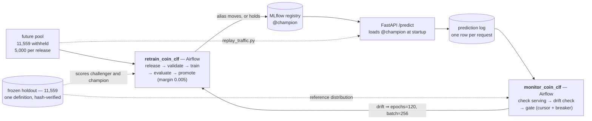

# MLOps platform for an image classifier — retraining, promotion gating, and drift monitoring

[](https://github.com/Davids3498/Coins/actions/workflows/ci.yml)

The workload is a Roman-coin classifier: photos of Roman Imperial coins sorted by
emperor, 51 classes, 57,792 images, a MobileNetV3-Large at **0.9201** holdout
accuracy. The deliverable is everything around it — a dataset carved once into
partitions that are *provably* disjoint by content hash, an MLflow registry whose
`@champion` alias only moves through a gate that re-scores both models, a FastAPI
server that logs every prediction, an Evidently drift check over that log, and two
Airflow DAGs that close the loop from "traffic looks wrong" back to "a new
challenger was trained, scored, and accepted or refused."

The coins are interchangeable. The pipeline is the point.

## Architecture



## Drift detection, demonstrated

Two replay runs against champion v10 — 600 and 601 requests — scored against the
champion's own predictions on the 11,559-image holdout. `normal` sends untouched
file bytes from the unreleased future pool; `skewed` restricts to 5 classes,
downsizes to 96px and converts to grayscale.

| Signal | Normal | Skewed | Threshold | Method |
|---|---|---|---|---|
| `predicted_label` | 0.114 | **0.606** | 0.35 | Jensen-Shannon |
| `confidence` | 0.053 | **0.812** | 0.25 | Wasserstein (normed) |
| `width` | 0.058 | **0.870** | 0.25 | Wasserstein (normed) |
| `height` | 0.059 | **0.876** | 0.25 | Wasserstein (normed) |
| `mode` | 0.000 | **0.833** | 0.35 | Jensen-Shannon |

`status=ok, drift_detected=false` for the normal run; `status=ok,
drift_detected=true` on all three signals for the skewed one. Both runs saw only
v10 rows — 0 excluded for a version mismatch. The machine-readable verdicts the
DAG branches on are tracked: [normal](docs/drift_verdict_normal.json),
[skewed](docs/drift_verdict_skewed.json).

Two results worth more than the pass/fail:

* **Normal traffic's mean confidence was 0.786; the reference's was 0.780.** That
  is the holdout-as-reference choice validating itself empirically — unseen
  production-shaped images score where the holdout scores, which is exactly why
  the reference is not the training split (the champion trained on that for 120
  epochs, so its confidence there is memorization-inflated and day-one traffic
  would look like drift).
* **The skewed batch contained 5 true classes but drew 16 distinct predictions.**
  Degradation doesn't just shift mass onto the right 5 labels — it pushes the
  model into confusions it never makes on clean inputs. The red bars below are
  the degraded batch; the grey is the reference across all 51 classes.


## Quickstart — the whole loop in five commands

```bash
make mlflow                                     # 1. tracking server + registry (terminal 1)
make build && make serve                        # 2. serving container, loads @champion (terminal 2)
PYTHONPATH=src python3 replay_traffic.py --mode skewed   # 3. 600 degraded requests
make drift                                      # 4. score them against the champion's reference
xdg-open outputs/monitoring/drift_report_*.html # 5. read the verdict
```

Swap `--mode skewed` for `--mode normal` to see the other column of the table
above. `make champion` prints the version currently aliased, and
`make health` shows what the container is actually serving.

## Serving

`app/main.py` loads the model in a FastAPI **lifespan** (startup), not at import.
That is what lets the module be imported with no registry reachable, which is how
the tests inject a fake bundle through `app.dependency_overrides` and how CI's
`--network none` import smoke test works.

By default it loads from the MLflow registry — `models:/coin-classifier@champion`,
the full `nn.Module`, not a state dict. `MODEL_SOURCE=local` instead loads a
champion baked into the image at build time, which is what the Fargate deployment
runs and the only thing that differs about it; see [Cloud deploy](#cloud-deploy).
Both paths report the same registry version on `/health`.

- `GET /health` — `status`, `device`, `num_classes`, `model_name`, `model_version`, `model_source`
- `POST /predict?topk=N` — multipart image upload → `{model_version, predictions: [{label, probability}]}`
  - optional `X-Traffic-Source` header: a monitoring tag (the replay script sets
    it to separate a normal from a deliberately skewed batch). It changes nothing
    about the prediction, only how the logged row is grouped later.

Preprocessing is `coin_clf.transforms.val_transform`, the same object training
uses: `Resize(256) -> CenterCrop(224) -> ImageNet normalize`. Labels come from
`app/coin_labels.json` (index → emperor name), overridable with `LABELS_PATH`.

Every request writes one row — version, label, confidence, width/height/mode,
latency, source — to the SQLite prediction log (`coin_clf.prediction_log`). That
log is the only thing observing this model in production and the sole input to the
drift check. It is strictly an observer: `log()` never raises, `/predict` wraps it
anyway, and it is the last thing the endpoint does. Image metadata is read from
the upload **before** `.convert("RGB")`, or every row would report `mode="RGB"`
forever and the mode drift signal would be permanently dead.

Configuration, all environment variables:
`MODEL_SOURCE=registry` (`registry` | `local`), `MLFLOW_TRACKING_URI=http://127.0.0.1:5000`,
`MODEL_NAME=coin-classifier`, `MODEL_ALIAS=champion`, `BAKED_MODEL_DIR=<repo>/model`
(read only when `MODEL_SOURCE=local`), `LABELS_PATH=app/coin_labels.json`,
`PREDICTION_LOG_PATH=<repo>/outputs/monitoring/predictions.db`.

The container needs the tracking server (for the alias) and its artifact store
(for the weights), so `make serve` runs it on the host network with `~/.aws`
mounted read-only and the prediction-log directory bind-mounted — without that
mount the log dies with the `--rm` container and the host-side drift check has
nothing to read.

<details>
<summary>The equivalent raw <code>docker run</code></summary>

```bash
docker run --rm --network host \
  -v ~/.aws:/root/.aws:ro \
  -v "$PWD/outputs/monitoring:/srv/outputs/monitoring" \
  -e AWS_DEFAULT_REGION=us-east-1 \
  -e PREDICTION_LOG_PATH=/srv/outputs/monitoring/predictions.db \
  coin-classifier:latest
```

</details>

The image is CPU-only (`python:3.10-slim` + CPU torch/torchvision wheels): the
model is 4.27M parameters with the 51-class head, so single-image inference does
not need a GPU. For GPU serving, swap the base image for an `nvidia/cuda` runtime
and install the `cu121` wheels in `serve.Dockerfile`.

To run it without Docker, you need Python 3.10 with `torch`, `torchvision`, the
packages in `requirements-serve.txt`, and a reachable tracking server:

```bash
pip install -r requirements-serve.txt && pip install -e . --no-deps
uvicorn app.main:app --host 0.0.0.0 --port 8000
```

## Dataset and its boundaries

Every number below is re-derived from file bytes by `verify_data_integrity.py`;
the full output of the last run is tracked at `docs/verify_data_integrity_run.txt`.

```
62,134  original images
 4,342  quarantined by clean_duplicates.py (byte-duplicates + cross-label conflicts)
57,792  clean corpus (data/clean_files.txt) — hash-unique, all decode end-to-end

carved once by splits.py, seed 42, into data/splits_manifest.json:
  34,674  train        (~60%)
  11,559  frozen holdout (~20%)  fingerprint c47d3f321a0e13c2 — THE holdout
  11,559  future pool  (~20%)    withheld; stands in for data arriving after launch
```

The future pool is released in batches of 5,000 (`BATCH_SIZE` in
`dags/retrain_coin_clf.py`); `data/future_pool_cursor.json` counts batch
*numbers*, so the size must stay fixed for as long as one cursor is in use.
Two batches are released, which is why `data/active_train.txt` currently holds
44,674 files (34,674 manifest train + 10,000 released) and 1,559 future-pool
images remain unreleased.

Three rules the code enforces rather than documents:

* **Clean by default.** Every entry point in `coin_clf.data` resolves to the
  clean list; a missing clean list or manifest raises `RawTreeError` instead of
  falling back to the raw tree. Reaching unfiltered data requires typing
  `allow_raw_tree=True` at the call site.
* **One holdout.** `build_manifest_holdout` is the only definition in live code.
  The two that used to compete with it (`frozen_split`, `build_test_dataset`) are
  deleted, and there is a test plus an integrity check asserting they stay deleted.
* **Disjointness by content hash, not filename.** `active_split` re-hashes both
  sides and refuses to return if any training image is byte-identical to a
  holdout image. The same physical coin uploaded twice under two filenames is a
  leak that index bookkeeping cannot see.

## Retraining pipeline

`dags/retrain_coin_clf.py` — `schedule=None`, one run per simulated batch
arrival, `max_active_runs=1`, `retries=0` (every task has a side effect that is
not safe to replay: appending to the active-train list, advancing the cursor,
registering a version, moving an alias).

```
release_batch → validate → gate_on_validation → train → evaluate → promote
```

Every step shells out to an existing CLI with `PYTHONPATH=src /usr/bin/python3`,
which is exactly what the Makefile does — a run reproduced by hand is the run
Airflow makes, not a near-miss. Airflow's own process never imports torch.

* **release_batch** — pops the next 5,000-image future-pool batch, appends it to
  `data/active_train.txt`, writes the batch's `(path,label)` rows for validation.
  A drained pool is a hard error, not a "bad batch".
* **validate** — `python -m coin_clf.validate_batch`: readable (a real decode —
  see the engineering notes), RGB mode, minimum dimensions, known label, class
  balance (no class over 50% of a batch), no intra-batch duplicates, no leakage
  against the reference set. It reports a verdict; it never raises for a bad image.
* **gate_on_validation** — short-circuits train/evaluate/promote on an invalid
  batch. The DAG run stays **green**: a rejected batch is a normal outcome
  recorded in `report.json`, not a pipeline failure.
* **train** — `train_hard_labels.py`. Reads `epochs` / `batch_size` from
  `dag_run.conf` directly rather than through `params`, because that override
  depends on an `airflow.cfg` setting; a triggered retrain silently getting the
  3-epoch smoke default would train on a truncated cosine curve and then look
  like a model failure at the gate. It aborts if the holdout fingerprint has
  moved. Registers a challenger; it does not touch `@champion`.
* **evaluate** — scores the challenger on the frozen holdout, logs the metric.
* **promote** — moves `@champion` only if the challenger beats it by
  `--margin 0.005`. Re-scores **both** models fresh (never trusts a logged
  number), is idempotent, bootstraps when there is no champion, and holds
  fail-safe if the champion cannot be scored. A HOLD is logged, not raised.

The gate has actually refused: v10 (0.9201) is champion, and v11 scored 0.9150 on
the same holdout and was held. Both were produced by DAG runs, not by hand.

## Monitoring loop

`dags/monitor_coin_clf.py` — the closed loop.

```
check_serving_version → read_state → drift_check → gate_on_drift → trigger_retrain
```

* **check_serving_version** fails fast if the container is serving something other
  than `@champion`; a blind monitor must look broken rather than green.
* **drift_check** runs `drift_report.py` over the prediction log since the state
  cursor. The reference is **the champion's own predictions on the holdout**, not
  the training labels — comparing predictions to labels would bake the model's
  ~8% error rate into the baseline as a permanent non-zero floor, and labels carry
  no confidence at all. It is cached per champion version, and production rows are
  filtered to that version, so a v11-vs-v10 comparison can't manufacture drift.
  Thresholds were *measured* against a simulated null at n=500 rather than
  defaulted — the obvious 0.1 would fire on every normal batch — and the
  confidence one is marked provisional in the source because it has no measured
  null behind it yet.
* **gate_on_drift** triggers only on `status == "ok" AND drift_detected`.
  `insufficient_data` (under 500 rows), `no_data` and `no_reference` all mean
  "couldn't tell", which is not "no drift" and is certainly not grounds for a
  120-epoch run — that is why the verdict carries a status field and not a bare
  boolean. It also skips (rather than queues) when a retrain is already in flight.
* **trigger_retrain** passes the real recipe: `epochs=120, batch_size=256`, plus
  the reason, so the retrain run permanently records why it exists.

Runaway protection lives in `monitor_state.py`, and it is two mechanisms because
they cover different failures: a **consuming cursor** (advances only when a
verdict was actually rendered, so the same rows can never re-fire) and a
**circuit breaker** (two consecutive triggered retrains that end without a
promotion means retraining is not the fix — drift keeps being reported, but the
trigger stops).

`replay_traffic.py` is the traffic source. Requests go over HTTP against the
running container rather than through in-process inference on purpose: the point
is to exercise the real serving path, decode and log write included. It is
read-only with respect to pipeline state — it reads the future-pool cursor, never
advances it, and never appends to `active_train.txt`.

## Cloud deploy

The serving container was provisioned on AWS Fargate with Terraform, verified against the local
container, and destroyed — inside one session, for about 1.5 cents. `infra/` holds the HCL,
`docs/terraform_run.txt` holds the terminal capture of all of it. **This is IaC that was run,
not IaC that was written.** Nothing is left standing; the numbers below came off a real task.

### What Terraform provisions

19 resources in `us-east-1`, every one tagged `Project=coin-mlops` (via the provider's
`default_tags`, so a resource added later is findable by default):

| File | Resources |
| --- | --- |
| `network.tf` | VPC `10.20.0.0/16`, internet gateway, two public subnets across AZs, route table + associations, security group (in `8000/tcp`, all out) |
| `ecr.tf` | ECR repository (`force_delete`, keep-1-image lifecycle policy) |
| `ecs.tf` | cluster, Fargate task definition (0.5 vCPU / 1 GB, X86_64), service (`desired_count = 1`, `assign_public_ip = true`), CloudWatch log group at `retention_in_days = 1` |
| `iam.tf` | ECS task execution role, GitHub OIDC provider, CI deploy role + policy |
| `outputs.tf` | task public IP, ECR URL, cluster/service names, deploy role ARN |

`./infra/destroy.sh` runs `terraform destroy -auto-approve` and then **asks AWS directly**
whether anything survived — clusters, services, running tasks, tagged VPCs, NAT gateways,
Elastic IPs, ECR repositories, log groups, IAM roles, the OIDC provider. It exits `2` if
anything is found. `terraform destroy` reporting success is not proof: it only knows about
resources in its own state, so a partial apply or an out-of-band change is invisible to it.

### The deliberate omissions

**No NAT gateway.** It bills ~$0.045/hr the moment it exists, plus $0.045/GB processed, whether
or not anything is running — the single most likely way to overrun a small budget. It exists to
give *private* subnets outbound internet. The task runs in a *public* subnet with a public IP
and an internet-gateway route, which gives it outbound (ECR pull, CloudWatch) and inbound (the
curl that proves it serves) for nothing. The public IPv4 that replaces it costs $0.005/hr —
about 11× cheaper — and only while a task is running.

**No load balancer.** An ALB is ~$16/month plus LCU charges, and buys a stable DNS name, TLS
termination, and health-check-driven replacement. None of that is what this demonstrates.
Traffic goes straight to the task's public IP. The cost, stated plainly: the IP changes every
time ECS replaces the task, there is no TLS, and `/predict` is an unauthenticated upload open to
`0.0.0.0/0`. All three are fine for a stack whose entire life is one apply, one curl, and one
destroy. All three are wrong for anything that stays up.

**Local state, gitignored.** An S3 backend with a DynamoDB lock table is the correct production
answer and takes about fifteen lines. It is omitted because it is itself two resources that
outlive `terraform destroy` — the bucket holding the state cannot be destroyed by the state it
holds — and the contract here was that nothing remains. One operator, one machine, one apply at
a time; the difference is invisible at this size and visible the moment a second person applies.

### The champion-resolution tradeoff

`app/main.py` selects its model source with `MODEL_SOURCE`, and it is the only thing that
differs between the two deployments:

- **`registry` (default, local).** Resolves `models:/coin-classifier@champion` against the
  tracking server at startup. The alias is the source of truth: `promote.py` moves it and the
  next restart serves the new model with no rebuild. That indirection is the point of having a
  registry at all.
- **`local` (cloud).** Loads a champion already exported into the image. `serve.Dockerfile`
  **cannot start on Fargate** — the alias lookup and the artifact download both happen at
  startup, and the tracking server is a local SQLite-backed process on a developer's machine
  with no route from a task. So `serve-cloud.Dockerfile` starts `FROM` the serving image and
  copies in the export.

Freezing an alias throws away the indirection that made it useful, so the mitigation is
provenance. `scripts/export_champion.py` writes `champion.json` beside the artifact recording
the name, alias, **version**, run ID and export time; `app/main.py` reads the version from it,
**refuses to start without it**, and reports it on `/health` alongside `model_source`. A cloud
container that cannot name the champion it serves is an untraceable binary, and comparing its
output to local output would prove nothing.

**What running this for real needs: a reachable tracking server.** With one, the cloud task uses
`serve.Dockerfile` unchanged, the second Dockerfile disappears, and the alias goes back to being
the single source of truth in both places. The bake is a workaround for a missing piece of
infrastructure, not an architecture — which is also why the CI deploy job fails loudly at the
export step today rather than pretending otherwise.

### CI → AWS auth: OIDC, no long-lived keys

`.github/workflows/ci.yml` gained a `deploy` job that is **`workflow_dispatch` only** — gated
twice, by the trigger and by `if: github.event_name == 'workflow_dispatch'`, plus a `confirm`
input the operator must type. It starts a billable task; a merge must not be able to reach it.

There is no `AWS_ACCESS_KEY_ID` or `AWS_SECRET_ACCESS_KEY` in this repository, in GitHub
secrets, or on a developer's machine. The job requests a short-lived token from GitHub
(`permissions: id-token: write`), `aws-actions/configure-aws-credentials@v4` exchanges it, and
AWS returns credentials that expire with the job. The trust policy lives in `infra/iam.tf`, not
in a console nobody can review, and is scoped to `repo:Davids3498/Coins:*` — no other
repository, and no fork, can assume it. A leaked access key is valid until a human notices; a
leaked OIDC token is valid for minutes and only for this repo.

Permissions are split by who needs them. The **task execution role** gets ECR pull and
CloudWatch Logs and *nothing else* — no S3, because the model is baked in and the running
container never calls AWS. The application gets no task role at all. The **CI deploy role**
additionally gets read on the MLflow artifact bucket, because the runner must download the
champion before it can build the cloud image. That is the one permission here that is not
self-evident, so it is called out rather than quietly added.

### The parity result

`docs/terraform_run.txt` is the full capture. The same image
(`data/FOR_TRAINNING/05_NERO/side_a/image24113.jpg`) through three deployments:

| | local, `registry` | local, `local` | **Fargate** |
| --- | --- | --- | --- |
| `model_version` | 10 | 10 | **10** |
| `model_source` | `registry` | `local` | **`local`** |
| top-1 label | NERO | NERO | **NERO** |
| top-1 probability | 0.8328765630722046 | 0.8328765630722046 | **0.8328765034675598** |

Same champion, same label, same top-3 ordering (`NERO`, `GORDIAN I`, `DIDIUS JULIANUS`).

The two **local** paths are bit-identical, which is the result that matters for the bake:
freezing the model into an image introduces exactly zero numerical drift. Local vs Fargate
agrees to 7 significant figures (relative delta 7.2e-08), not bit-for-bit — and that gap is CPU
microarchitecture, not the deployment. float32 convolution and GEMM kernels reassociate
differently across SIMD widths, so a developer machine and a Fargate host reduce the same sums
in a different order. It is attributable to hardware *precisely because* the two local paths
matched exactly on one machine. Bit-identical float across CPUs would need deterministic kernels
and a pinned thread count, which costs throughput and would prove nothing further.

### Running it

```bash
python scripts/export_champion.py                      # needs `make mlflow` + S3 access
docker build -f serve.Dockerfile       -t coin-classifier:latest .
docker build -f serve-cloud.Dockerfile -t coin-classifier:cloud  .

cd infra && terraform init
terraform apply -target=aws_ecr_repository.app         # the repo must exist to push to
# docker login / tag / push  (see docs/terraform_run.txt)
terraform apply                                        # the rest; blocks until a task is RUNNING
curl "$(terraform output -raw service_url)/health"

cd .. && ./infra/destroy.sh                            # tears down, then proves it
```

Apply is two-phase because the task definition pins an ECR tag that does not exist until the
image is pushed; a single apply leaves the service crash-looping on `CannotPullContainerError`.

**Cost of the run above: ~$0.015.** The task lived 30.6 minutes (`14:02:43Z` → `14:33:21Z`) at
$0.0246/hr for 0.5 vCPU / 1 GB plus $0.005/hr for the public IPv4; ECR storage stayed inside the
500 MB free tier and CloudWatch ingested a few KB. Cost Explorer still reported `$0` with
`Estimated=true` when queried an hour after teardown — CE lags usage by up to 24 hours — so that
figure is derived from the metered timestamps and published us-east-1 rates, not read back off a
settled bill.

## Engineering notes

Three things that were wrong and what fixing them changed.

**A "readable" check that passed unreadable files.** The retraining gate derived
`readable` from PIL's `verify()`, which validates the JPEG header and stops. A
file truncated mid-scan keeps an intact header: it opens, reports its true width,
height and mode, passes every check, enters the training set, and raises `OSError`
the first time a DataLoader touches it mid-epoch — the guard succeeding on exactly
the case it exists to catch. `readable` is now a full decode
(`image_meta.decodes`) while metadata stays a header parse, because serving
decodes each upload anyway and must not pay twice. Cost measured, not assumed:
0.2ms/image, ~2.2s for a 5,000-image batch inside a task that already runs for
minutes. The regression test writes a *noise* image, because a flat-colour JPEG is
~693 bytes and mostly header — truncating it destroys the header, every reader
rejects it, and the test would pass against the old code and prove nothing.

**A duplicated constant that manufactured a leak.** `verify_data_integrity.py`
kept its own copy of the DAG's future-pool batch size. The copy went stale at 200
against the DAG's 5,000, and the resulting arithmetic about which images had been
released reported **9,600 phantom leakage collisions** — a data-integrity checker
confidently crying leak. Correcting the number would have fixed the run and left
the mechanism: two constants that must agree, in files nobody edits together. So
the copy was deleted instead. The DAG's `BATCH_SIZE` is now the single
declaration, read by AST (importing it would pull in airflow, which the test
environment deliberately lacks). The test that matters doesn't check the value —
it fails if the duplication comes back.

**A `.dockerignore` that was a standing bug.** It listed what to exclude, and it
fell behind the repo: written before the Airflow venv, the 44 GB DVC cache and
`weights/`, so `docker build` streamed a 50 GB context to produce a ~1 GB image.
A denylist here is wrong again the next time anyone adds a big directory, and
nothing fails loudly when it does. It is now an allowlist — exclude everything,
re-include exactly the four paths the Dockerfile copies. A new large directory is
ignored by default, and a new `COPY` that needs something has to say so or the
build fails loudly.

## Known limitations

**The serving container resolves `@champion` once, at startup.** After a
promotion it keeps serving and *logging* the old version until someone restarts
it, and monitoring goes blind in the meantime — the drift check filters
production rows to the current champion, so it finds nothing to compare. It fails
safe (no spurious trigger) and it fails visibly (`check_serving_version` is the
monitoring DAG's first task and fails the run), but the real fix is a reload
endpoint or a rolling restart on promotion. Deliberately deferred, not overlooked.

**Drift and retraining are not causally connected.** The monitor detects degraded
*traffic*; the retrain ingests clean *future-pool* images and does nothing about
the degradation that fired it. In a production system a labeling pipeline sits
between the two — the drifted images get labels, join the training set, and the
holdout rolls forward with the distribution instead of staying frozen. This repo
has both ends and no middle, because there are no production labels to build the
middle out of. The frozen holdout is the right call for *this* system (it makes
v10 and v11 comparable at all) and the wrong one for a system whose input
distribution genuinely moves.

## Layout

Code sits in two layers, deliberately. `src/coin_clf/` is the shared library — the only
installed package, and everything the serving image and every script imports. The pipeline
CLIs stay at the repo root: they need `splits.py`'s `DatasetSplits`/`FuturePool`, and
`coin_clf` must never import a root script, so they live one level above the package rather
than inside it. The DAGs shell out to them by name (`PYTHONPATH=src python3 train_hard_labels.py`),
which is also how the Makefile runs them, so a run reproduced by hand is the run Airflow makes.

```
src/coin_clf/  the shared library — model, transforms, data/split access, labels, hashing,
               image metadata, batch validation, prediction log, v6 teacher (load-only)
app/           FastAPI serving app (main.py, coin_labels.json)
dags/          Airflow DAGs — retrain_coin_clf and monitor_coin_clf
*.py at root   the pipeline CLIs — see "Root scripts" below
tests/         the whole pytest suite, plus fixtures/make_tree.py (a ~60-image stand-in
               for the real tree, so verify_data_integrity.py can be exercised in CI)
scripts/       one-off utilities — seed_champion.py, export_champion.py (freezes the
               registry's @champion into build/champion/ for the cloud image)
infra/         Terraform for the Fargate deploy, split by concern (network, ecr, ecs, iam,
               outputs, variables) + destroy.sh, which tears down and then verifies
notebooks/     archived model-development notebooks — history, not maintained code;
               excluded from ruff and pytest. They use absolute paths, because VS Code
               sets a notebook's cwd to its own directory
docs/          reference material + the tracked integrity run; working notes are local-only
.github/       CI workflow — the merge gate, plus the manual-only deploy job
serve.Dockerfile       the serving image; resolves @champion at startup, bakes in nothing
serve-cloud.Dockerfile FROM the above + the exported champion; MODEL_SOURCE=local, for Fargate
makefile       control panel: mlflow, airflow, build, serve, train, retrain, drift, health
.airflow_env.sh  AIRFLOW_HOME / DAGs folder / port + the airflow venv, sourced by `make airflow`
```

Generated or too large to track — gitignored, except where noted:

```
data/          the dataset is gitignored and DVC-tracked (FOR_TRAINNING/, archives/,
               quarantine/), but the small files that DEFINE the splits are tracked:
               splits_manifest.json, clean_files.txt, active_train.txt,
               future_pool_cursor.json, drop_log.csv
weights/       all .pth / .onnx checkpoints
mlflow/        local MLflow tracking store (mlflow.db)
build/         champion/ — the exported model the cloud image bakes in (~24 MB), plus
               anything setuptools leaves behind
infra/*.tfstate  Terraform state and .terraform/ — local and gitignored, see "Cloud deploy"
outputs/       generated artifacts — monitoring/ (prediction log, drift reports, verdicts,
               monitor_state.json), dag_runs/, gradcam_out/, misclassified/
misc/          loose non-project images
.venv-airflow/ the Airflow interpreter — deliberately separate from the torch/mlflow one
```

Three compatibility symlinks at the repo root (`FOR_TRAINNING`, `misclassified`,
`prediction_result.png`) keep the notebooks' absolute paths working. The first is
not decoration: `verify_data_integrity.py` (check B1c) asserts the alias discovers
the same file set as `data/FOR_TRAINNING`, so a stale symlink is caught rather
than silently trained through.

## Root scripts

The retraining and monitoring pipeline, as individually runnable CLIs. Grouped by what they do:

**Dataset boundaries** — the code all three leakage incidents came out of.

- `splits.py` — the ONE place the dataset is carved into train / frozen-holdout / future-pool. The manifest it writes is the single definition of the holdout in the codebase.
- `verify_data_integrity.py` — read-only proof, from the bytes on disk, that the partitions are what the code thinks they are. Writes nothing. Three sections: partition integrity, every data-loading entry point actually called and fingerprinted, and unreachability of the deleted raw-tree/rival-holdout paths.
- `check_split_leakage.py` — index-level and content-level checks that the three splits share no image.
- `clean_duplicates.py` — hash-groups the raw tree, collapses exact duplicates, drops bytes filed under more than one emperor.

**Train → evaluate → promote** — what the `retrain_coin_clf` DAG shells out to, in order.

- `release_batch.py` — pops the next future-pool batch and folds it into `data/active_train.txt`.
- `train_hard_labels.py` — the headless twin of `coin_mobilenet_hard_labels.ipynb`; the DAG's training step, and what produced the current champion. Defaults: 120 epochs, batch 128 (a monitor-triggered run passes 256).
- `train.py` — the general-purpose training CLI (`make train`). Defaults: 60 epochs, batch 128.
- `evaluate.py` — scores a registered version on the frozen holdout; `promote.py` re-uses `evaluate_version` so both sides of the gate are scored on the same split.
- `promote.py` — the promotion gate: moves `@champion` only if the challenger clears the margin.
- `checkpoint.py` — safe checkpoint saving for `train.py`; writes a run-id-tied filename and refuses to overwrite, so a local `.pth` always maps back to a known run.

**Production feedback loop** — what `monitor_coin_clf` runs.

- `replay_traffic.py` — replays future-pool images through the live `/predict` endpoint as stand-in production traffic (`--mode normal|skewed`).
- `drift_report.py` — scores a window of the prediction log against the champion's reference distribution; emits an Evidently HTML report plus a machine-readable verdict.
- `monitor_state.py` — the monitoring state machine and its persisted state (cursor + circuit breaker), plus the `--check-serving` preflight. Stdlib-only at module scope, so the Airflow venv can import it.

**Elsewhere**

- `export.py` — ONNX export + int8 quantization, verified against the same frozen holdout.
- `scripts/seed_champion.py` — registers a checkpoint as the `@champion` model in the MLflow registry. This is how v1 got there; every version since was registered by a training run.

## Make targets

| Target | What it does |
|---|---|
| `make mlflow` | tracking server — SQLite backend, S3 artifact root, `--no-serve-artifacts` |
| `make airflow` | `airflow standalone` on port 8090 (not 8080 — see `.airflow_env.sh`) |
| `make build` / `make serve` | build the serving image / run it wired to MLflow + the log mount |
| `make health` | pretty-print `/health` |
| `make champion` | print the version currently aliased `@champion` |
| `make train` / `make retrain` | `train.py` / `train_hard_labels.py`, `ARGS="--epochs 1"` for a smoke run |
| `make install` | `pip install -e . --no-deps` — editable `coin_clf`, leaves your CUDA torch alone |
| `make monitoring-install` | evidently, for the offline drift check (deliberately not in the serving image) |
| `make drift` | run the drift check → HTML report + verdict in `outputs/monitoring` |

## Tests and CI

```bash
pip install torch==2.2.2 torchvision==0.17.2 --index-url https://download.pytorch.org/whl/cpu
pip install -r requirements-dev.txt
pip install -e . --no-deps    # `make install`
python -m pytest -q -m "not needs_data and not needs_gpu"
```

Install order matters: `pyproject.toml` declares torch/torchvision as
dependencies, so a plain `pip install -e .` re-resolves them from PyPI and drags
in ~2.5 GB of CUDA wheels no test can use. `--no-deps` keeps the CPU wheels.

**159 tests, ~35s**, all under `tests/`, with no dataset, no GPU, no MLflow server
and no AWS credentials — the same conditions the CI runner has.
`.github/workflows/ci.yml` runs that command on every PR alongside `ruff check .`
and `mypy src/coin_clf` (scoped to the shared library; the root scripts still
report 11 errors, widening it is a follow-up), asserts no `nvidia-*` wheel slipped
into the install, and in a second job builds the serving image and imports it with
`--network none` — the mechanical check that the registry load stays inside the
lifespan and the app stays importable without infrastructure.

The workflow has a third job, `deploy`, which is **manual only** — `workflow_dispatch`
plus an `if:` on the event, plus a `confirm` input the operator has to type. It
builds and pushes the cloud image and forces a new ECS deployment, authenticating
with OIDC rather than stored keys. Nothing on `push` or `pull_request` can reach
it, because it starts a task that bills. See [Cloud deploy](#cloud-deploy) — and
note it fails at the export step until a tracking server exists that a hosted
runner can reach.

Anything that would need the real 57,792-image tree or CUDA gets the `needs_data`
/ `needs_gpu` marker instead of being deleted; nothing carries either one today
(`--strict-markers` makes a typo'd marker an error rather than a silent no-op).
`verify_data_integrity.py` is the one check that cannot run in CI — it re-hashes
the whole tree — so `tests/test_verify_data_integrity.py` runs it against a
~60-image stand-in, injecting one specific fault per test and asserting the check
that should notice actually names it.

## Data & weights

The training dataset (`data/FOR_TRAINNING/`) and all `.pth`/`.onnx` checkpoints
(`weights/`) are gitignored — too large for the repo. The dataset is
version-controlled with DVC instead: `data/FOR_TRAINNING.dvc` is the tracked
pointer, and the remote is `s3://davids-mlops-artifacts-8412/dvc` — the same
bucket MLflow writes model artifacts to. What git tracks is source, notebooks,
this README, and the small JSON/TXT/CSV files under `data/` that define the split
boundaries and record what the cleanup dropped.

## Model history

Before any of the above existed, the project was a series of notebooks iterating
on feature extraction, head architecture and ensembling. These numbers are the
record of what was tried. They are **not comparable to the registry's
accuracies**: they predate the duplicate/label-conflict cleanup and the
single-holdout carve, and the ad-hoc splits they were scored on leaked — one such
raw-tree 80/20 draw overlapped the training set by 5,689 images (see `export.py`).
Read the table as a ranking of approaches, not as accuracy anyone should quote.

| Notebook | Approach | Test acc (pre-cleanup) |
|---|---|---|
| `emp_model_v2.ipynb` | Frozen C-RADIO v4-H + linear head | 84.99% |
| `emp_model_v3.ipynb` | + MLP/cosine head, mixup, class-balanced sampling, 5-head ensemble | 87.51% |
| `emp_model_v3_TTA.ipynb` | + TTA feature extraction, 10-head ensemble | 88.82% |
| `emp_model_v4.ipynb` | + ArcFace, patch tokens, hierarchical classifier (frozen backbone) | 88.69% |
| `emp_model_v4.1.ipynb` | + fine-tuned C-RADIO backbone | 92.05% |
| `emp_model_v5.ipynb` | Multi-stream (portrait/legend crops + DINOv2) — regressed | 91.73% |
| `emp_model_v6.ipynb` | + per-stream projection, hard-pair sub-classifiers | **92.71% (best)** |
| `emp_model_v7.ipynb` | Frozen DINOv2-only baseline (phase 1, no fine-tuning follow-up) | 85.78% |
| `emp_model_knowledge_distilation.ipynb` | MobileNetV3-Large distilled from the v6 ensemble | 89.61% |
| `emp_model_mobilenet_baseline.ipynb` | Same MobileNetV3, plain CE (no distillation) — comparison | 89.02% |

**The distillation path is retired.** The v6 teacher trained on contaminated data,
so the soft labels and everything distilled from them inherited it — `train.py` no
longer imports `coin_clf.teacher`, and `verify_data_integrity.py` (section C5)
checks that it cannot come back. The live recipe is
`notebooks/coin_mobilenet_hard_labels.ipynb` and its headless twin
`train_hard_labels.py`: MobileNetV3-Large, class-balanced cross-entropy with label
smoothing, 120 epochs, warmup + cosine decay, scored on the canonical
11,559-image holdout.

## License

MIT — see [LICENSE](LICENSE).
