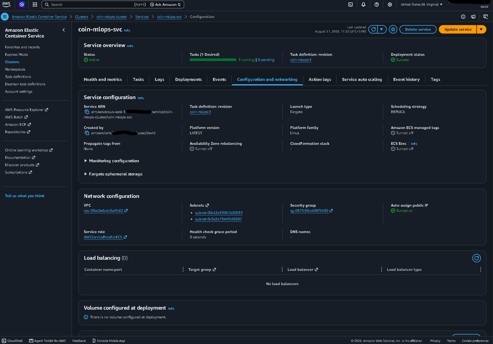
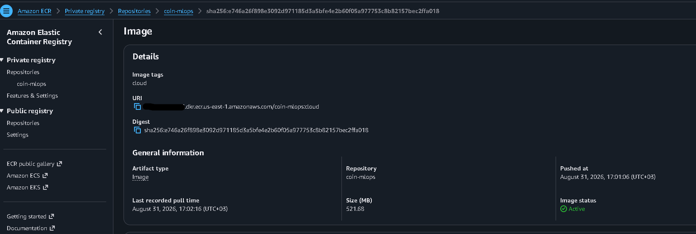
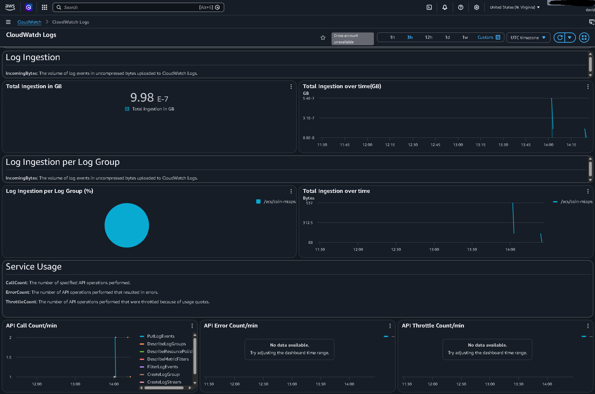
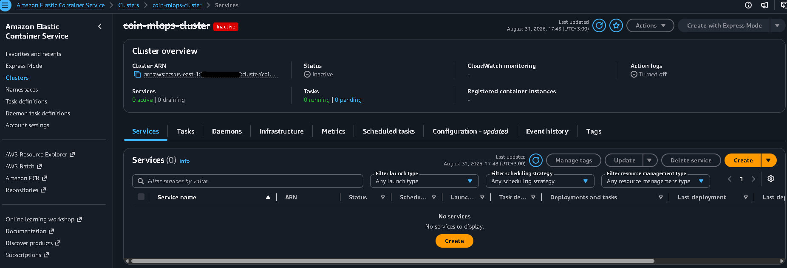

# Cloud deploy

[← back to the README](../README.md)

The serving container, provisioned on AWS Fargate with Terraform, verified against the local container, and destroyed — in one session, for about 1.5 cents. This is the full write-up; the README carries the summary. `infra/` holds the HCL and [terraform_run.txt](terraform_run.txt) is the terminal capture of the whole run.

#The serving container was provisioned on AWS Fargate with Terraform, verified against the local
container, and destroyed — inside one session, for about 1.5 cents. `infra/` holds the HCL,
`terraform_run.txt` holds the terminal capture of all of it. **This is IaC that was run,
not IaC that was written.** Nothing is left standing; the numbers below came off a real task.

## What Terraform provisions

19 resources in `us-east-1`, every one tagged `Project=coin-mlops` (via the provider's
`default_tags`, so a resource added later is findable by default):

| File | Resources |
| --- | --- |
| `network.tf` | VPC `10.20.0.0/16`, internet gateway, two public subnets across AZs, route table + associations, security group (in `8000/tcp`, all out) |
| `ecr.tf` | ECR repository (`force_delete`, keep-1-image lifecycle policy) |
| `ecs.tf` | cluster, Fargate task definition (0.5 vCPU / 1 GB, X86_64), service (`desired_count = 1`, `assign_public_ip = true`), CloudWatch log group at `retention_in_days = 1` |
| `iam.tf` | ECS task execution role, GitHub OIDC provider, CI deploy role + policy |
| `outputs.tf` | task public IP, ECR URL, cluster/service names, deploy role ARN |

`./infra/destroy.sh` runs `terraform destroy -auto-approve` and then **asks AWS directly**
whether anything survived — clusters, services, running tasks, tagged VPCs, NAT gateways,
Elastic IPs, ECR repositories, log groups, IAM roles, the OIDC provider. It exits `2` if
anything is found. `terraform destroy` reporting success is not proof: it only knows about
resources in its own state, so a partial apply or an out-of-band change is invisible to it.

## The deliberate omissions

**No NAT gateway.** It bills ~$0.045/hr the moment it exists, plus $0.045/GB processed, whether
or not anything is running — the single most likely way to overrun a small budget. It exists to
give *private* subnets outbound internet. The task runs in a *public* subnet with a public IP
and an internet-gateway route, which gives it outbound (ECR pull, CloudWatch) and inbound (the
curl that proves it serves) for nothing. The public IPv4 that replaces it costs $0.005/hr —
about 11× cheaper — and only while a task is running.

**No load balancer.** An ALB is ~$16/month plus LCU charges, and buys a stable DNS name, TLS
termination, and health-check-driven replacement. None of that is what this demonstrates.
Traffic goes straight to the task's public IP. The cost, stated plainly: the IP changes every
time ECS replaces the task, there is no TLS, and `/predict` is an unauthenticated upload open to
`0.0.0.0/0`. All three are fine for a stack whose entire life is one apply, one curl, and one
destroy. All three are wrong for anything that stays up.

**Local state, gitignored.** An S3 backend with a DynamoDB lock table is the correct production
answer and takes about fifteen lines. It is omitted because it is itself two resources that
outlive `terraform destroy` — the bucket holding the state cannot be destroyed by the state it
holds — and the contract here was that nothing remains. One operator, one machine, one apply at
a time; the difference is invisible at this size and visible the moment a second person applies.

## The champion-resolution tradeoff

`app/main.py` selects its model source with `MODEL_SOURCE`, and it is the only thing that
differs between the two deployments:

- **`registry` (default, local).** Resolves `models:/coin-classifier@champion` against the
  tracking server at startup. The alias is the source of truth: `promote.py` moves it and the
  next restart serves the new model with no rebuild. That indirection is the point of having a
  registry at all.
- **`local` (cloud).** Loads a champion already exported into the image. `serve.Dockerfile`
  **cannot start on Fargate** — the alias lookup and the artifact download both happen at
  startup, and the tracking server is a local SQLite-backed process on a developer's machine
  with no route from a task. So `serve-cloud.Dockerfile` starts `FROM` the serving image and
  copies in the export.

Freezing an alias throws away the indirection that made it useful, so the mitigation is
provenance. `scripts/export_champion.py` writes `champion.json` beside the artifact recording
the name, alias, **version**, run ID and export time; `app/main.py` reads the version from it,
**refuses to start without it**, and reports it on `/health` alongside `model_source`. A cloud
container that cannot name the champion it serves is an untraceable binary, and comparing its
output to local output would prove nothing.

**What running this for real needs: a reachable tracking server.** With one, the cloud task uses
`serve.Dockerfile` unchanged, the second Dockerfile disappears, and the alias goes back to being
the single source of truth in both places. The bake is a workaround for a missing piece of
infrastructure, not an architecture — which is also why the CI deploy job fails loudly at the
export step today rather than pretending otherwise.

## CI → AWS auth: OIDC, no long-lived keys

`.github/workflows/ci.yml` gained a `deploy` job that is **`workflow_dispatch` only** — gated
twice, by the trigger and by `if: github.event_name == 'workflow_dispatch'`, plus a `confirm`
input the operator must type. It starts a billable task; a merge must not be able to reach it.

There is no `AWS_ACCESS_KEY_ID` or `AWS_SECRET_ACCESS_KEY` in this repository, in GitHub
secrets, or on a developer's machine. The job requests a short-lived token from GitHub
(`permissions: id-token: write`), `aws-actions/configure-aws-credentials@v4` exchanges it, and
AWS returns credentials that expire with the job. The trust policy lives in `infra/iam.tf`, not
in a console nobody can review, and is scoped to `repo:Davids3498/Coins:*` — no other
repository, and no fork, can assume it. A leaked access key is valid until a human notices; a
leaked OIDC token is valid for minutes and only for this repo.

Permissions are split by who needs them. The **task execution role** gets ECR pull and
CloudWatch Logs and *nothing else* — no S3, because the model is baked in and the running
container never calls AWS. The application gets no task role at all. The **CI deploy role**
additionally gets read on the MLflow artifact bucket, because the runner must download the
champion before it can build the cloud image. That is the one permission here that is not
self-evident, so it is called out rather than quietly added.

## The parity result

`terraform_run.txt` is the full capture. The same image
(`data/FOR_TRAINNING/05_NERO/side_a/image24113.jpg`) through three deployments:

| | local, `registry` | local, `local` | **Fargate** |
| --- | --- | --- | --- |
| `model_version` | 10 | 10 | **10** |
| `model_source` | `registry` | `local` | **`local`** |
| top-1 label | NERO | NERO | **NERO** |
| top-1 probability | 0.8328765630722046 | 0.8328765630722046 | **0.8328765034675598** |

Same champion, same label, same top-3 ordering (`NERO`, `GORDIAN I`, `DIDIUS JULIANUS`).

The two **local** paths are bit-identical, which is the result that matters for the bake:
freezing the model into an image introduces exactly zero numerical drift. Local vs Fargate
agrees to 7 significant figures (relative delta 7.2e-08), not bit-for-bit — and that gap is CPU
microarchitecture, not the deployment. float32 convolution and GEMM kernels reassociate
differently across SIMD widths, so a developer machine and a Fargate host reduce the same sums
in a different order. It is attributable to hardware *precisely because* the two local paths
matched exactly on one machine. Bit-identical float across CPUs would need deterministic kernels
and a pinned thread count, which costs throughput and would prove nothing further.

## Console screenshots from the run

The identifiers in these line up with `terraform_run.txt` — same task ID, same VPC, subnet and
security-group IDs, same image digest — so they are the same run, not a re-staging of it.

<details>
<summary><b>Four console views: network config, pushed image, log ingestion, teardown</b></summary>

<br>

**Network configuration — no load balancer, public IP on.** The two decisions that replaced a
NAT gateway and an ALB, as the console reports them: `Load balancing (0) — No load balancers`,
and `Auto-assign public IP: Turned on`. VPC `vpc-03ec0a6cdc3a4fc62`, the two public subnets, and
security group `sg-037fc39ccb08f5430`.



**The pushed image.** Tag `cloud`, digest `sha256:e746a26f898e3092…c2ffa018` — the digest the
`docker push` reported and the one the running task pulled. 521.68 MB, pushed 17:01:06, first
pulled 17:02:16, about 90 seconds later.



**Log ingestion from the running task.** 9.98e-7 GB total, 100% of it from `/ecs/coin-mlops` —
the uvicorn startup lines and the access log for the `/health` and `/predict` calls below. This
is the measurement behind "CloudWatch ingested ~1 KB" in the cost breakdown.



**After teardown.** `coin-mlops-cluster` struck through and marked `Inactive`, `0 active | 0
draining` services, `0 running | 0 pending` tasks, `Services (0) — No services to display`. This
is the console agreeing with `destroy.sh`, which had already checked the same thing through the
API and exited `0`.



</details>

## Running it

```bash
python scripts/export_champion.py                      # needs `make mlflow` + S3 access
docker build -f serve.Dockerfile       -t coin-classifier:latest .
docker build -f serve-cloud.Dockerfile -t coin-classifier:cloud  .

cd infra && terraform init
terraform apply -target=aws_ecr_repository.app         # the repo must exist to push to
# docker login / tag / push  (see terraform_run.txt)
terraform apply                                        # the rest; blocks until a task is RUNNING
curl "$(terraform output -raw service_url)/health"

cd .. && ./infra/destroy.sh                            # tears down, then proves it
```

Apply is two-phase because the task definition pins an ECR tag that does not exist until the
image is pushed; a single apply leaves the service crash-looping on `CannotPullContainerError`.

**Cost of the run above: ~$0.015.** The task lived 30.6 minutes (`14:02:43Z` → `14:33:21Z`) at
$0.0246/hr for 0.5 vCPU / 1 GB plus $0.005/hr for the public IPv4. The image is 521.68 MB, so it
sat just *over* the 500 MB ECR free tier — 21.68 MB of billable storage for about half an hour,
which is $0.000002 and rounds to nothing. CloudWatch measured 9.98e-7 GB ingested (~1 KB).

Cost Explorer still reported `$0` with `Estimated=true` when queried an hour after teardown — CE
lags usage by up to 24 hours — so **that figure is derived from the metered timestamps and
published us-east-1 rates, not read back off a settled bill.**
